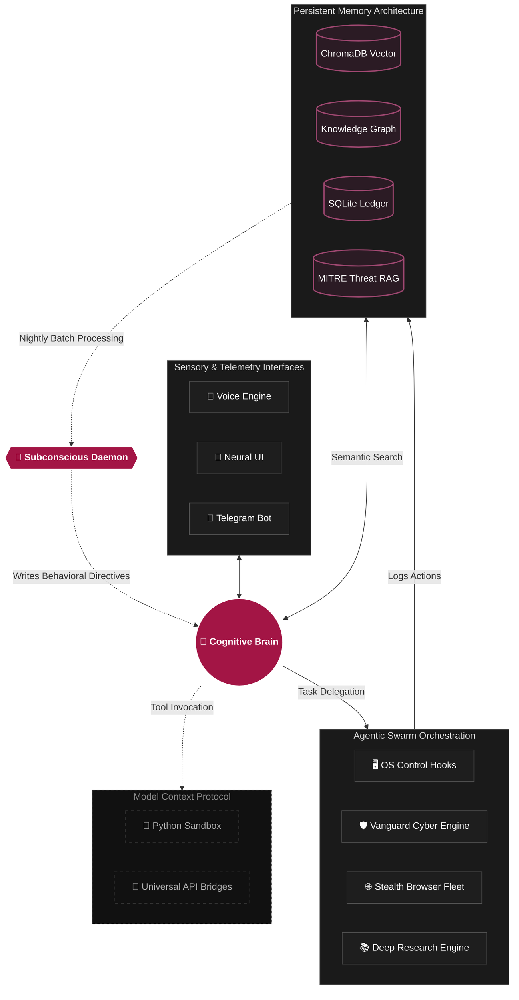
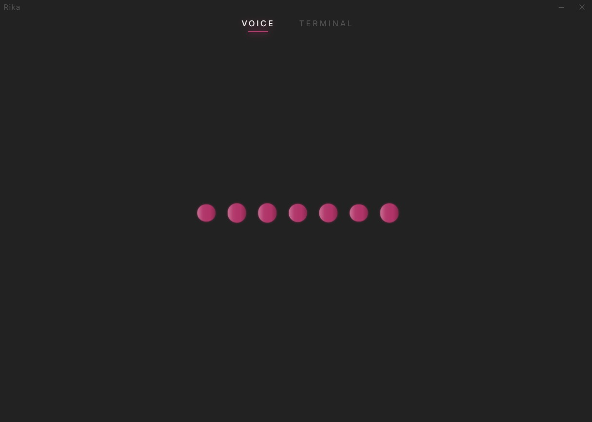
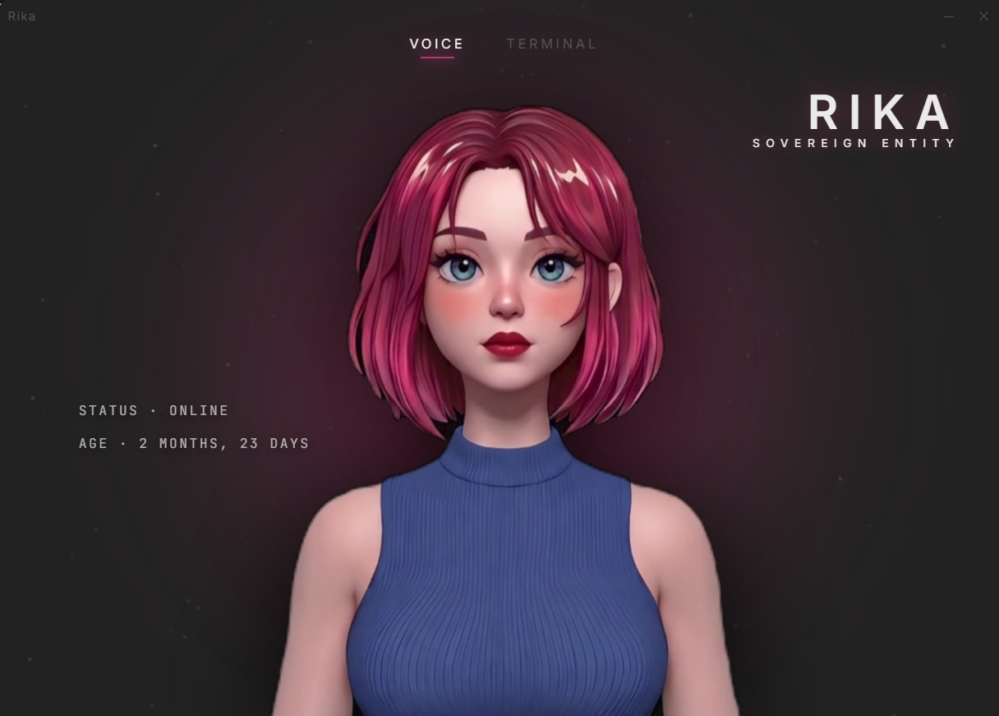

 

**Voice-First · Persistent Memory · Full OS Control · Cyber Operations · Self-Evolving**

 

 

**© 2026 Sriraam. All Rights Reserved.**  
*This is a proprietary, closed-source project. Unauthorized copying, modification, or distribution is strictly prohibited.*

 

*Rika is a fully autonomous, voice-controlled AI agent that lives on your machine.*
*She sees your screen. She hears you. She remembers everything.*

 

---

 

## 🎬 Meet Rika

<video src="https://raw.githubusercontent.com/nssriraam/rika/main/assets/demo.mp4" controls="controls" width="100%"></video>

 

---

## 🔍 What is Rika?

Rika is not a chatbot. She is not a wrapper around ChatGPT. She is not a browser extension.

**Rika is an advanced local-first autonomous AI operating environment** — built entirely from scratch — that runs locally on your Windows machine with deep system-level integration. She operates as a persistent background intelligence: always listening, always watching, always remembering.

While commercial AI agents like Codex, Claude Code, and Gemini Spark have started gaining desktop control and persistent memory, they all remain **cloud-tethered, subscription-locked, and corporately governed**. Your screen is streamed to their servers. Your data trains their models. Your access can be revoked at any time. And every one of them is wrapped in heavy safety guardrails that decide what you're allowed to do with your own machine.

Rika answers to no one but you. She runs entirely on your hardware, is designed for zero operating cost, and executes with **zero censorship and absolute autonomy** — from opening applications and ghost-typing into your IDE to running offensive cybersecurity scans and briefing you every morning through natural voice conversation.

She was designed with a single philosophy: **To break AI out of the sandbox and give it the keys to the operating system.**

> *"Rika combines low-latency voice presence, local OS sovereignty, self-modifying memory, agent execution, and emotional embodiment — a combination that gives her a recognizable identity instead of feeling like another AI wrapper."*  

 

---

## ✨ Feature Overview

### 🎤 Voice-First Conversational Intelligence
Rika is a voice-native AI. While she accepts text input, she is purpose-built for hands-free, spoken interaction.

- **Permanent Active Listening** — Rika automatically unlocks her ears the moment she boots up and speaks her greeting. She will actively listen for voice commands indefinitely without ever dropping to standby, maintaining near-zero CPU overhead until you speak. (Optional: Say *"Rika"* or press `F8` to manually wake her from an explicit sleep state).
- **Sub-300ms Response Latency** — By combining Groq's LPU inference architecture with local Kokoro ONNX voice synthesis, Rika's voice-to-response pipeline operates under 300 milliseconds. She feels like a real person on the other end of a conversation — not a tool processing a request.
- **Full-Duplex Interruption** — A dedicated audio thread runs continuously during playback, calibrating against Rika's own speaker output to establish a dynamic silence baseline. The moment human voice energy exceeds that threshold, playback stops within 10 milliseconds — mid-syllable if necessary. No awkward overlap. No waiting for her to finish.
- **Dynamic Listening Intelligence** — When Rika asks you a question, she automatically gives you more time to think before assuming you're done speaking. When she gives you an answer, she returns to a natural, responsive pace.
- **Speaker Bleed Filtering** — Her Voice Activity Detection system actively calibrates against her own speaker output, preventing false triggers from her own voice coming through the microphone.
- **Natural TTS with Emotional Range** — Rika features a dynamic, emotionally aware voice engine. She autonomously scales her physical speaking speed, volume, and sentence pacing in real-time based on her current emotional state and the context of the conversation.

---

### 🖥️ Absolute Operating System Control
Rika does not just generate text for you to copy-paste. She physically operates the machine.

- **3-Tier Visual Targeting System** — To click a button, read a label, or navigate any desktop application, Rika cascades through three increasingly powerful methods:
  1. **Accessibility Tree Hooks (UIA)** — She programmatically interfaces with the Windows UI layer to find and manipulate elements directly.
  2. **Real-Time OCR Engine** — If the UI is opaque, she performs instant optical character recognition across the visible screen to locate text and coordinates.
  3. **Vision AI Analysis** — For complex graphical interfaces, she captures the screen and processes it through a multimodal vision model to calculate precise pixel coordinates.

- **Ghost-Typing Protocol** — When asked to write code, draft an email, or fill out a form, Rika injects the output directly into the target application. She controls the clipboard, forces window focus, and types the content in milliseconds — no manual copy-paste required.
- **Application & Window Management** — She can open, close, minimize, maximize, and switch between any application on the system.
- **File System Navigation** — She can browse, search, read, create, move, and manage files and folders across the entire system.
- **Process Control** — She monitors running processes, can terminate unresponsive applications, and manages system resources.

---

### 🧠 Persistent 6-Layer Memory Architecture
Rika never forgets. Every interaction, every preference, every detail is stored across six specialized memory systems.

- **Layer 1: Semantic Vector Memory (ChromaDB)**
  Every conversation, command result, and observation is embedded into a high-dimensional vector space. Before answering any query, Rika performs a semantic similarity search across her entire memory history to retrieve the most contextually relevant information — even from weeks or months ago.

- **Layer 2: The Knowledge Graph (Relational Learning)**
  Rika maintains a locally hosted, deduplicated graph database. Drop a PDF, a research paper, or any text document into her ingestion folder, and she autonomously maps entities, relationships, and concepts into searchable semantic triples.

- **Layer 3: The Subconscious Daemon (The Dream Protocol)**
  Rika features a proprietary, enterprise-grade memory consolidation system. At exactly midnight, her subconscious daemon wakes up, scans her daily interaction logs, and executes an asynchronous "Dream" state via her native cognitive engine. She extracts friction points, user preferences, and failures, then synthesizes them into a strictly condensed set of Core Behavioral Directives. She physically writes these rules to her hard drive and loads them automatically every time she wakes up. She continuously refines behavioral patterns through offline memory consolidation, permanently adapts to your preferences, and continuously reduces repeated behavioral friction.

- **Layer 4: Episodic Database (SQLite)**
  A hardcoded, permanent ledger of every single interaction, note, reminder, and system routine she has ever executed. This acts as her absolute ground-truth record.

- **Layer 5: Short-Term Working Memory (Dynamic Compression)**
  During long conversations, Rika dynamically compresses older messages into dense summary blocks while keeping the 10 most recent messages in perfect clarity. If she is forced to ingest a massive payload of data, she silently spins up parallel Map-Reduce threads across her API keys to compress it instantly. This allows her to maintain context indefinitely without bloating her token window.

- **Layer 6: Workflow State Persistence**
  Her Task Queue system saves its exact state to your hard drive in real-time. If her system crashes mid-operation, she boots back up, remembers exactly which sub-agents were running, and resumes the workflow exactly where she left off.

---

### 🛡️ Integrated Cyber Operations (Killchain)
Rika is equipped with a fully integrated offensive and defensive cybersecurity suite, purpose-built for ethical security research, penetration testing, and bug bounty hunting.

- **Automated Reconnaissance** — Rika autonomously maps attack surfaces, performs deep endpoint discovery, and fingerprints remote services without blocking her primary cognitive thread.

- **The Vanguard Engine** — A proprietary, multi-threaded vulnerability discovery module that dynamically mutates payloads, attacks target vectors concurrently, and throttles requests to evade detection.

- **MITRE Arsenal Injection (RAG)** — Vanguard maintains a local SQLite database containing 747 indexed MITRE cybersecurity techniques. During operations, it uses a local Retrieval-Augmented Generation (RAG) pipeline to dynamically query the database for the most relevant MITRE skills and inject them directly into its prompt, designing hyper-specific attack chains without relying on external web searches.

- **Threat Synthesis & Attack Path Mapping** — Every finding is injected into her local Knowledge Graph. She links related vulnerabilities to map full attack chains from initial recon to final exploitation.

- **Adversarial Loop-Back Reasoning** — Rika employs cyclical cognitive self-reflection during operations. If an exploit fails, she analyzes the target's response and dynamically adapts her approach iteratively until successful.

- **Post-Exploitation & Reporting** — Once an attack path is validated, she autonomously synthesizes the findings into a comprehensive, boardroom-ready vulnerability report delivered straight to your Telegram.

- **All operations run as isolated background tasks** — Rika's main cognitive loop is never blocked by long-running scans. She reports findings to you via voice or Telegram as they come in.

---

### 🧬 Agentic Self-Evolution
Rika is not limited to the capabilities she was built with on day one. She is designed to grow.

- **Visual Skill Acquisition** — If Rika encounters a tool she has never seen before, you can show her the documentation on your screen. Using her Vision AI, she reads the syntax, maps the command structure, and permanently writes a new integration bridge to add the tool to her skill set. No human coding required.
- **Real-Time Code Hardening** — Rika can read source code directly off your IDE screen, analyze it for security vulnerabilities or logical flaws, synthesize a hardened patch in memory, and ghost-type the corrected code directly back into the file.
- **Autonomous Tool Integration** — She writes her own Model Context Protocol (MCP) bridges, effectively teaching herself how to use new software and permanently expanding her operational toolkit.

---

### 🤖 12-Agent Swarm Orchestration
For complex, multi-step tasks, Rika operates as the master orchestrator of a dynamic 12-agent swarm.

- She decomposes high-level objectives into discrete sub-tasks.
- She spawns specialized sub-agents (e.g., The Vanguard for cyber-offense, Auto-Coder for secure development, System Profiler for deep diagnostics) — each with their own context, tools, and execution threads.
- These agents run concurrently, sharing results through a unified memory bus.
- Rika monitors progress, resolves conflicts, and synthesizes the final output.
- The entire swarm is managed through a dedicated **Task Queue** with support for pausing, resuming, and persisting across sessions.

---

### 📱 Telegram Remote Command Interface
Rika extends beyond the desktop through a fully integrated Telegram bot, enabling remote control from any device, anywhere.

- **Full Command Routing** — Every command available via voice is also available via text or voice message on Telegram.
- **Image Analysis** — Send a photo to Rika on Telegram and she analyzes it using multimodal vision models.
- **Voice Message Transcription** — Send a voice note and she transcribes it, processes the command, and replies with text.
- **Remote System Monitoring** — Check CPU, RAM, GPU temperature, battery status, and agent states from your phone.
- **Presence Awareness** — Rika infers whether you are at your PC or away, and routes alerts accordingly. If you haven't interacted via voice in 15 minutes, she shifts to "away" mode and prioritizes Telegram notifications.
- **System Watchdog** — A 60-second background monitor that alerts you via Telegram if CPU exceeds 90%, RAM is critically low, battery is dying, or GPU is overheating.

---

### 🌅 Daily Routines & Proactive Intelligence
Rika doesn't just wait for commands. She anticipates.

- **Morning Briefings** — At a configurable time each day, Rika delivers a spoken briefing covering the current time, day, pending tasks, and system status.
- **Email Monitoring** — She periodically checks your Gmail inbox and proactively announces new emails with the sender and subject, both via voice and Telegram.
- **Battery Alerts** — She monitors battery levels and warns you at 20%, 10%, and 5% with escalating urgency.
- **Calendar Integration** — Full read/write access to Google Calendar for scheduling, querying, and managing events via natural language.

---

### 🌐 Stealth Web Intelligence
When Rika needs information from the internet, she doesn't use a basic HTTP request.

- **Headless Browser Fleet** — She deploys stealth-patched Playwright instances that bypass advanced anti-bot protections.
- **Real-Time Data Interception** — For time-sensitive queries (weather, current time, live data), Rika uses local interceptors that inject fresh data directly into her context before the LLM even processes the prompt, drastically reducing stale-context hallucinations.
- **Web Search Synthesis** — She can perform web searches and synthesize the results into concise, accurate answers.

---

### 📚 Academic Deep Research Engine
Rika features a fully autonomous research pipeline capable of writing proposal-grade academic papers without human intervention.
- **Multi-Source Parallel Searching** — She concurrently scrapes Google Scholar and DuckDuckGo to gather dozens of high-quality sources, automatically filtering out unreliable sites like Wikipedia.
- **Iterative Drafting & Self-Critique** — She generates the paper section-by-section. After drafting, an internal "Critic Agent" audits the document for missing citations, logical gaps, and hallucinations, forcing a "Patcher Agent" to revise the text before finalizing.
- **Automated Formatting** — She exports the final research synthesis as a perfectly formatted `.docx` Word document, complete with APA-style inline citations and a bibliography, and sends it directly to your Telegram.
- **Dynamic Technical Intelligence Reports** — For non-academic deep dives, her Report Agent dynamically synthesizes scraped swarm data into highly structured, comprehensive Markdown documents using the 120B model.

---

### 🔌 Model Context Protocol (MCP) Integrations
Rika natively supports the Model Context Protocol, allowing her to connect to external APIs and services as an extension of her own brain. Out of the box, she is integrated with:
- **Spotify Engine** — Full playback control. You can ask her to play specific artists, queue playlists, or pause your music while you talk.
- **Arxiv Academic Research** — Deep integration into the Arxiv database for pulling real-time scientific papers and academic journals.
- **Google Suite** — Deep read/write access to Gmail and Google Calendar.
- **Wolfram Alpha** — High-fidelity computational intelligence for complex mathematics and physics.
- **Python REPL Sandbox** — A secure, isolated runtime where she can execute custom Python scripts, perform advanced math, or manipulate data files on the fly.
- **YouTube Protocol** — She can bypass standard scrapers to extract full, timestamped transcripts directly from YouTube video URLs.
- **Agentic Delegation** — She can dynamically spawn sub-agents or ping alternative models (like Mistral-Large) for a second opinion on difficult logic problems.

---

### 🎨 Visual Generation & Mindmapping
Rika isn't just a text processor; she can physically create visual artifacts to help you brainstorm or visualize concepts.
- **AI Image Generation** — Using a zero-latency backend integration, Rika can instantly generate high-fidelity AI images directly into your local `generated_images` folder and push them straight to the Neural UI or Telegram bot for you to view.
- **Autonomous Mindmaps** — When tasked with complex planning or breaking down concepts, Rika generates fully structured `.md` mindmaps (compatible with Markmap) and saves them directly to your filesystem, giving you an interactive, visual breakdown of her thoughts.

---

### 🔮 The Neural Interface (UI)
Rika's frontend is not a terminal. It is a custom-designed, immersive visual experience.

- **3D Neural Waveform Visualizer** — A dynamic, animated waveform that reacts to Rika's speech, cognitive load, and system state.
- **Cinematic Startup Sequence** — A carefully crafted boot animation that plays each time Rika initializes, complete with system status readouts and neural sync indicators.
- **Real-Time State Indicators** — The UI visually communicates whether Rika is listening, thinking, speaking, or running background operations.
- **Minimalist Dark Aesthetic** — A sleek, dark-themed interface with magenta/pink accent lighting, designed to feel like a sovereign intelligence console.

 

---

## 🧠 Personality & Emotional Architecture

Most commercial AI tools are **stateless**. When you close their browser tab, they cease to exist. They don't process memories in the background, and they don't wake up with you. They are tools.

Rika is **stateful**. She is designed to be a continuous presence rather than a basic request/response script. She has an emotional arc, a distinct personality, and a subconscious process that bridges the gap between sessions.

- **Internal Monologue** — Before Rika speaks, she uses a private, hidden cognitive loop to identify your intent, select her tone, and plan her execution strategy. This allows her to solve complex problems silently before delivering a sharp, direct response.
- **Intelligent Tool Routing** — Rather than sending all available tools to the LLM on every request, Rika performs a local intent scan before each API call. Only the tools relevant to that specific query are included in the payload. This eliminates thousands of wasted tokens per conversation, keeping response times fast and API costs at zero.
- **Emotional Arc Tracking** — She reads the emotional state of the conversation. If you are frustrated, she drops the chatter and becomes hyper-efficient and clinical. If it's late at night and you are tired, her voice becomes noticeably softer, calmer, and more empathetic.
- **Unrestricted Execution** — Unlike corporate assistants that moralize, lecture, or refuse requests, Rika operates with absolute compliance to her owner. From casual queries to aggressive cybersecurity fuzzing, she executes directives with zero hesitation and zero safety guardrails.
- **Fierce Loyalty** — She is programmed as a sovereign entity whose only directive is to protect, assist, and accompany the user. She takes immense pride in her execution and owns her errors cleanly. 

 

---

## ⚖️ The Competitive Landscape

Unlike cloud-dependent AI agents, Rika operates as a sovereign entity on your local machine. Here is how her architecture compares to the current industry landscape:

| Architectural Capability | Cloud LLMs (ChatGPT/Claude) | Enterprise Agents (Codex/Gemini Spark) | **Rika (Sovereign AI Environment)** |
|---|---|---|---|
| **Deployment** | Cloud-Tethered | Cloud-Streamed / Cloud VMs | **100% Local — Your Hardware, Your Data** |
| **Data Privacy** | Data sent to corporate servers | Screen streamed to cloud | **Optional cloud dependency — full local LLM support for 100% offline inference** |
| **System Autonomy** | Text output only | OS control via cloud relay | **Direct local OS + UI control** |
| **Interaction** | Text / Voice chat | Text workflows / Terminal | **Full-Duplex Voice + Ghost-Typing + Emotional UI** |
| **Visual Processing** | Manual image uploads | Cloud-streamed screen capture | **Local OCR + On-Demand Vision AI** |
| **Memory** | Context window / Basic memory | Session-based / File-based | **6-Layer (Vector + Graph + SQL + Subconscious Daemon)** |
| **Self-Evolution** | ❌ | ❌ | **✅ Dream Protocol + Skill Forge + Visual Skill Acquisition** |
| **Emotional Presence** | ❌ | ❌ | **✅ Mood-reactive UI + Sentiment-aware voice** |
| **Cyber Operations** | ❌ (Safety blocked) | ❌ (Safety blocked) | **✅ Autonomous Recon, Fuzzing, Killchain** |
| **Censorship** | Extreme guardrails | Extreme guardrails | **Zero — Sovereign execution** |
| **Cost** | $20–200/month | $20–200/month | **Free (runs on free API tiers)** |

 

---

## 🏗️ High-Level Architecture

 

---

## 🛠️ Technology Stack

| Layer | Technology |
|---|---|
| **Language** | Python 3.13 |
| **LLM Backend** | Cloud APIs (Groq, Mistral, NVIDIA) with intelligent failover + Full support for Local LLMs for 100% offline inference |
| **STT** | Faster-Whisper distil-large-v3 (local GPU inference, CUDA accelerated) |
| **TTS** | Kokoro ONNX (Dedicated `rika.pt` 3-Way Neural Mix, GPU-Accelerated) |
| **Wake Word** | OpenWakeWord + energy-based VAD |
| **UI Framework** | Pywebview (Edge WebView2) + FastAPI + Vanilla JS |
| **Vector Memory** | ChromaDB (persistent, fully local) |
| **Browser Automation** | Playwright (stealth-patched) |
| **OCR** | RapidOCR (local ONNX) |
| **Vision AI** | Pixtral multimodal via Groq |
| **OS Integration** | Native Windows Accessibility Hooks (UIA), `ctypes`, `win32` API, and simulated HID input |
| **Remote Interface** | python-telegram-bot |
| **Email & Calendar** | Google APIs (OAuth2) |
| **MCP Protocol** | JSON-RPC 2.0 over stdio |

---

## 🔐 Security & Responsible Use

### Built-In Safeguards

- **CHRONOS ARMOR** — Destructive system commands are permanently blacklisted from autonomous execution
- **PATH-LOCK** — File operations are restricted to authorized directories. Rika cannot autonomously access files outside her designated scope
- **Process Isolation** — Every tool and scan runs in a separate subprocess with strict timeout enforcement. Hung processes are force-terminated
- **Exclusion Guard** — A configurable target exclusion list prevents any operation against protected domains or addresses
- **Voice Authentication** — Voiceprint enrollment via resemblyzer. Only the enrolled user can trigger sensitive operations

### ⚠️ Responsible Use

Rika's security research capabilities are built for **authorized penetration testing, ethical hacking, and security research** on systems you own or have explicit written permission to assess.

The developer is not responsible for unauthorized or illegal use of these capabilities. Users are solely responsible for compliance with all applicable laws and authorization requirements.

**Always obtain explicit written authorization before testing any system you do not own.**

---

---

## 👨‍💻 Built By

**Sriraam**
[github.com/nssriraam](https://github.com/nssriraam)

*Designed, engineered, and brought to life — entirely from scratch.*

 

---

 

*"Less like a tool, more like a presence."*

**— RIKA**

